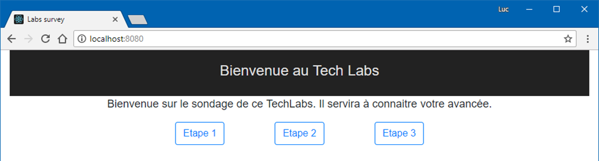

# Build de l'image et test local sur docker

Nous partons sur le projet Lab survey ([https://github.com/Riges/lab-survey/tree/dotnet-core-proxy](https://github.com/Riges/lab-survey/tree/dotnet-core-proxy)). Cela va nous permettre d'avoir un front et son api dissociés du stockage qui sera un Redis.

## Definition des services 📝

Afin de pouvoir créer les conteneurs nécessaires, nous nous servirons du fichier `docker-compose.yml` qui se décompose en deux services :

### Le service redis

Ce que nous voulons, c'est un conteneur du nom **lab-survey-redis** basé sur l'image **redis** et qui demande d'exposer son port **6379**, celui par défaut de redis, sur le port **6379** de l'host docker. On obtient donc la configuration suivante :

```yaml
lab-survey-redis:
  image: redis
  container_name: lab-survey-redis
  ports:
      - "6379:6379"
```

### Le service front

#### Le Dockerfile

Pour construire l'image, nous aurons besoin d'un 'Dockerfile', un fichier permettant de définir le processus de construction de l'image. Le programme étant en .Net Core et comme Microsoft nous fournit tous les outils, nous ferons un _multi-stage build_ permettant d'avoir une partie de build de l'application sur une image dédiée au build lors d'une étape. Puis nous récupérerons le résultat du build pour lancer l'application sur une image dédiée à l'hébergement de cette application.

Pour la partie build de l'application nous utiliserons l'image **microsoft/aspnetcore-build:2.0.6-2.1.101** que nous nommerons **build-env** et nous travaillerons dans le répertoire **/src**. Comme les dépendances changent moins que le code source d'une application, nous nous en occuperons en premier afin que cette partie de l'image reste en cache. Pour pouvoir restaurer les dépendances grâce à la commande 'dotnet restore', nous copierons le fichier **lab-survey-front.csproj** dans l'image. Une fois cela fait, nous copierons le reste des sources dans l'image et nous utiliserons la commande 'dotnet publish' en spécifiant que nous voulons la configuration **Release** et que le répertoire de sortie sera nommé **out**.

```Dockerfile
FROM microsoft/aspnetcore-build:2.0.6-2.1.101 AS build-env
WORKDIR /src
COPY lab-survey-front/lab-survey-front.csproj .
RUN dotnet restore
COPY ./lab-survey-front ./
RUN dotnet publish -c Release -o out
```

Pour l'étape d'hébergement de l'application compilée, nous utiliserons l'image **microsoft/aspnetcore:2.0.6** en copiant les fichiers générés par l'étape **build-env** dans le répertoire **/src/out** dans le répertoire de travail courant de cette image **/app**. Nous lui préciserons une variable d'environnement, **ASPNETCORE_URLS**, permettant de choisir le format d'url de l'application (**http://+:5000**) ce qui permettra de connaitre le port/tcp à exposer. Le point d'entrée de l'image se fera sur la commande **dotnet** en utilisant la dll générée par l'étape de build **lab-survey-front.dll**.

```Dockerfile
FROM microsoft/aspnetcore:2.0.6
WORKDIR /app
COPY --from=build-env /src/out ./
ENV ASPNETCORE_URLS=http://+:5000
EXPOSE 5000/tcp
ENTRYPOINT ["dotnet", "lab-survey-front.dll"]
```

#### La définition de la configuration

Pour ce conteneur, on voudra le nommer **lab-survey-front** et on exposera le port **5000** du conteneur sur le port **8080** de l'hôte. On va aussi définir une variable d'environnement portant la clef **REDIS** et qui contiendra le nom du conteneur du redis (**lab-survey-redis**) afin de pouvoir l'appeler depuis l'application et une autre clef **ASPNETCORE_ENVIRONMENT** permettant de stipuler pour quel type d'environnement est buildée l'image (**Production**). Pour l'image, nous ne partons pas d'une existante. C'est pourquoi, nous devons la builder depuis le fichier 'Dockerfile' du dossier de l'application. Pour cela, nous allons définir un paramètre **build** et lui donner le chemin du dossier parent de ce Dockerfile précédemment créé : **./lab-survey-front**. Pour nommer l'image, nous prendrons **lab-survey-front** dans le but de s'en servir à nouveau sans la builder à nouveau.

En prenant tout cela en compte, on devrait avoir une configuration ressemblant à :

```yaml
lab-survey-front:
  image: lab-survey-front
  container_name: lab-survey-front
  build:
    context: .
    dockerfile: lab-survey-front/Dockerfile
  environment:
    REDIS: lab-survey-redis
    ASPNETCORE_ENVIRONMENT: Production
  ports:
    - "8080:5000"
```

## Build 🏭 et déploiement 🚢 des images

Il est temps d'utiliser Docker afin de construire ses images et les stocker dans la registry local. Pour ce faire, nous utiliserons la commande 'docker-compose' afin d'arriver au résultat voulu.

### Vérification du fichier docker-compose.yml

Pour être sûr que nous n'avons pas d'erreur dans le fichier, nous utiliserons la commande **config** avec comme paramètre le nom du fichier suivant **-f ./docker-compose.yml**. On obtient alors `docker-compose -f ./docker-compose.yml config`. Si tout fonctionne, on doit voir s'afficher les lignes suivantes :

```sh
> docker-compose -f ./docker-compose.yml config
services:
  lab-survey-front:
    build:
      context: C:\Users\lfasquelle\code\soat\techlab-docker-kubernetes\etape 1\lab-survey
      dockerfile: lab-survey-front/Dockerfile
    container_name: lab-survey-front
    environment:
      ASPNETCORE_ENVIRONMENT: Production
      REDIS: lab-survey-redis
    image: lab-survey-front
    ports:
    - 8080:5000/tcp
  lab-survey-redis:
    container_name: lab-survey-redis
    image: redis
    ports:
    - 6379:6379/tcp
version: '3.0'
```

### Build des images 🏭

La commande **build** nous permettra de construire l'image sans pour autant la déployer en local. Suite à cela, nous pourrons vérifier la présence des images. Pour y parvenir, nous utiliserons les commandes 'docker-compose build' et 'docker images'.

```sh
> docker-compose build
Building lab-survey-front
Step 1/12 : FROM microsoft/aspnetcore-build:2.0.6-2.1.101 AS build-env
 ---> 76ce1481a4b8
Step 2/12 : WORKDIR /src
Removing intermediate container b9c96023e4f1
 ---> a69e3b735c07
Step 3/12 : COPY lab-survey-front/lab-survey-front.csproj .
 ---> bbef42c60c31
Step 4/12 : RUN dotnet restore
 ---> Running in 9a0c63087529
  Restoring packages for /src/lab-survey-front.csproj...
  Restoring packages for /src/lab-survey-front.csproj...
  Installing Microsoft.NETCore.DotNetAppHost 2.0.3.
  ...
  Generating MSBuild file /src/obj/lab-survey-front.csproj.nuget.g.props.
  Generating MSBuild file /src/obj/lab-survey-front.csproj.nuget.g.targets.
  Restore completed in 8.16 sec for /src/lab-survey-front.csproj.
Removing intermediate container 9a0c63087529
 ---> b19c51f1e50f
Step 5/12 : COPY ./lab-survey-front ./
 ---> 6bb395e2937b
Step 6/12 : RUN dotnet publish -c Release -o out
 ---> Running in a478b7f28ea3
...
  lab-survey-front -> /src/out/
Removing intermediate container a478b7f28ea3
 ---> bee05e762f1a
Step 7/12 : FROM microsoft/aspnetcore:2.0.6
 ---> c8e388523897
Step 8/12 : WORKDIR /app
Removing intermediate container 92e98ba82b12
 ---> ad38d7c41d9c
Step 9/12 : COPY --from=build-env /src/out ./
 ---> 2158a91e174c
Step 10/12 : ENV ASPNETCORE_URLS=http://+:5000
 ---> Running in b06db85fbf2b
Removing intermediate container b06db85fbf2b
 ---> 84aa4ce954ed
Step 11/12 : EXPOSE 5000/tcp
 ---> Running in 25855833a7ed
Removing intermediate container 25855833a7ed
 ---> 2ef6e15e70c4
Step 12/12 : ENTRYPOINT ["dotnet", "lab-survey-front.dll"]
 ---> Running in 5bbe114ee072
Removing intermediate container 5bbe114ee072
 ---> f8c9262d55bf
Successfully built f8c9262d55bf
Successfully tagged lab-survey-front:latest
lab-survey-redis uses an image, skipping
> docker images
REPOSITORY                                               TAG                 IMAGE ID            CREATED             SIZE
lab-survey-front                                         latest              f8c9262d55bf        21 minutes ago      332MB
redis                                                    alpine              cb1ec54b370d        13 days ago         27.1MB
```

Sur ce retour, nous remarquons deux informations importantes :

* _lab-survey-redis uses an image, skipping_ signifiant que lab-survey-redis n'a pas besoin d'être build car ce n'est qu'une définition du conteneur
* _lab-survey-front_ a bien été buildé il y a 10 secondes et que l'image porte l'id **f8c9262d55bf**. Elle est à présent dans la liste des images disponibles.

### Deployer localement 🚢

Pour déployer localement, il faut utiliser la commande **up** suivie du paramètre **-d** afin de détacher les conteneurs du terminal qui a lancé la commande et ainsi éviter que la commande ne se termine pas une fois le terminal fermé.

`docker-compose up -d`

```sh
> docker-compose up -d
Pulling lab-survey-redis (redis:latest)...
latest: Pulling from library/redis
c4bb02b17bb4: Pull complete
58638acf67c5: Pull complete
f98d108cc38b: Pull complete
c6ce5793a207: Pull complete
3fc67899101b: Pull complete
b55db4b27fa5: Pull complete
Digest: sha256:42e145fc86543c5ee3d8f50ad491adc1a452318b115301cc44c405676f9dd19b
Status: Downloaded newer image for redis:latest
Creating lab-survey-redis ... done
Creating lab-survey-front ... done
```

Si tout s'est bien passé, vous devriez voir un retour comme ci-dessus. Cependant, pour vérifier que les conteneurs sont bien lancés, deux solutions s'offrent à vous :

* aller sur [http://localhost:8080](http://localhost:8080) 
* lancer une commande 'docker ps --filter name=lab-survey' afin de voir les conteneurs lancés actuellement en filtrant par leurs noms.

```sh
> docker ps --filter name=lab-survey
CONTAINER ID        IMAGE               COMMAND                  CREATED             STATUS              PORTS                    NAMES
08cd885d20c1        lab-survey-front    "dotnet lab-survey-f…"   33 minutes ago      Up 33 minutes       0.0.0.0:8080->5000/tcp   lab-survey-front
e75852c926aa        redis               "docker-entrypoint.s…"   33 minutes ago      Up 33 minutes       0.0.0.0:6379->6379/tcp   lab-survey-redis
```

## Félicitation, vous avez déployé votre application. 🎊🏆🎉

Voilà maintenant, vous savez comment construire un **DockerFile**, un fichier _docker-compose_, ainsi que builder et deployer des conteneurs.
