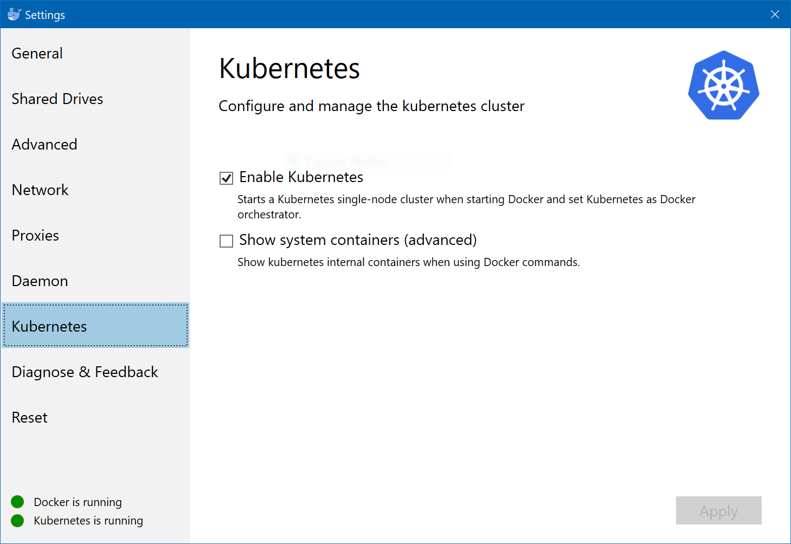

# Techlab docker et kubernetes

Le but de ce Techlabs est de vous guider vers le déploiement d'une application sur un cluster Kubernetes.

## Prérequis

* Docker for windows (version 18.03.0-ce-win58, build 16761) disponnible sur le channel [edge](https://download.docker.com/win/edge/Docker%20for%20Windows%20Installer.exe).
* Kubectl (version 1.9.2)

Une fois Docker for windows (ou mac) installer il vous faudra activer la prise en charge de Kubernetes comme ci-dessous.

## Étapes
